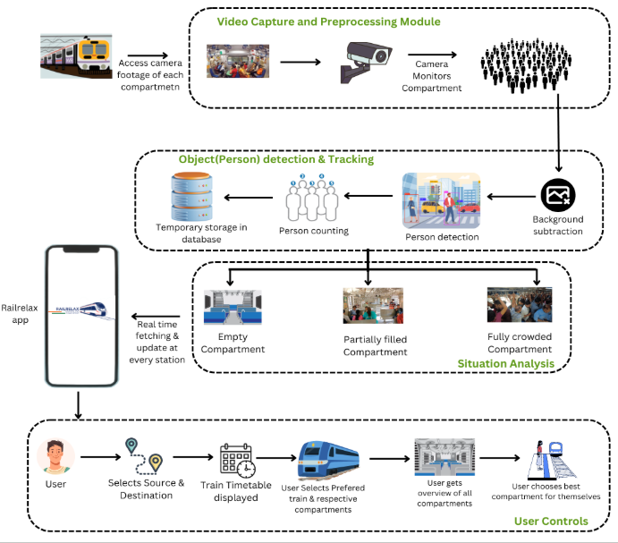
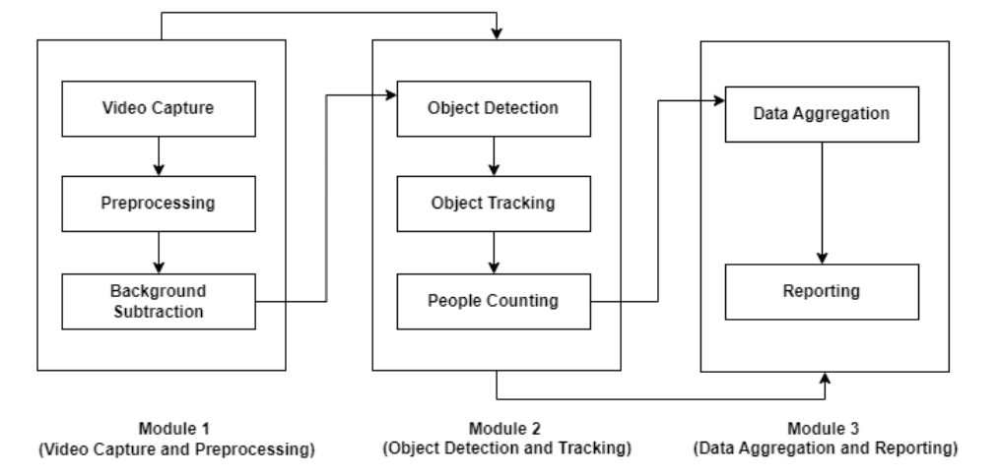
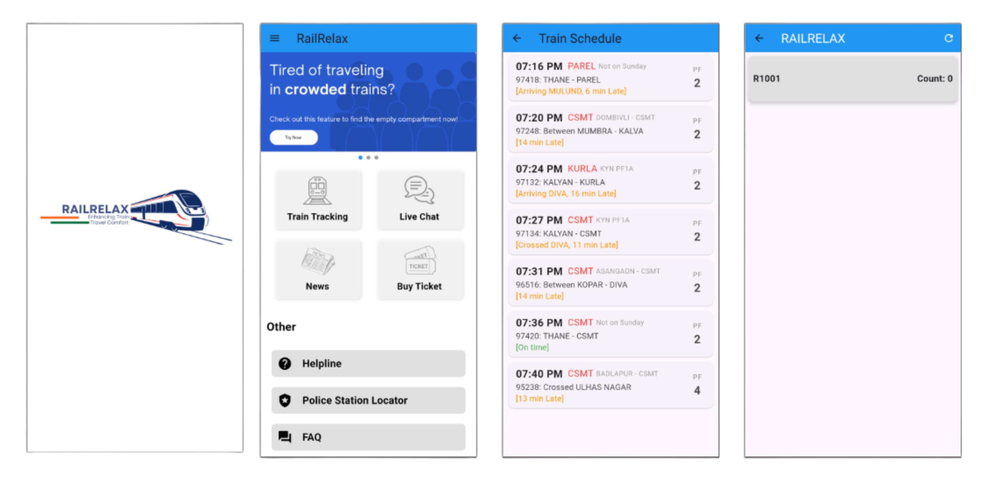

# 🚆 RailRelax: Smart Crowd Monitoring for Mumbai Locals

**RailRelax** is an AI-powered, real-time crowd density detection system for Mumbai local trains. Using low-cost hardware like ESP32-CAM and deep learning models like YOLOv3, RailRelax helps commuters choose less crowded compartments for a safer and more comfortable journey.

---

## 🧩 Problem Statement

Mumbai's local trains handle **7.5 million daily commuters** over a network spanning 390 km. Peak hours often cram up to **4500 passengers into coaches built for 1750**, leading to:

- Delays and discomfort
- Accidents and fatalities (7–8 deaths daily on average)
- Unsafe passenger distribution

---

## 🎯 Project Goals

- 📷 Use **ESP32-CAM** modules and **YOLOv3** for real-time people detection.
- ☁️ Store compartment-wise passenger data in **Firebase Realtime Database**.
- 📱 Provide crowd status via a **mobile app** as "Empty", "Partially Filled", or "Crowded".
- ⚙️ Optimize detection performance for **embedded systems and low-power devices**.

---

## 🔬 Methodology

1. **Capture**: ESP32-CAM captures images at regular intervals (approx. 5 min).
2. **Detection**: YOLOv3 identifies people in images.
3. **Aggregation**: Count from two cameras per compartment → maximum used as final count.
4. **Upload**: Data is pushed to **Firebase RTDB**.
5. **Fetch**: The mobile app polls the database and visualizes the data.

---

## 📐 System Architecture

<p align="center">
  
</p>

<p align="center">
  
</p>

---

## 📦 Tech Stack

### 📸 Hardware
- **ESP32-CAM** modules (2 per compartment)
- Raspberry Pi 4 (optional)
- MicroSD, power supplies, and ESP cables
- Firebase cloud (storage + API)

### 💻 Software
- **Python**, **OpenCV**, **NumPy**, **TensorFlow/Keras**
- **YOLOv3** for object detection
- **Firebase** for real-time data
- **Flutter/Dart** for app frontend
- **Flask** for API endpoint setup (optional)

---

## 🧠 Model Justification

| Model          | Precision | Recall | mAP@0.50 |
|----------------|-----------|--------|----------|
| YOLOv3         | 54.0      | **99.6** | 35.0     |
| YOLOv4-Tiny    | 84.0      | 51.0    | 62.2     |
| YOLOv8         | 83.8      | 68.1    | **78.2** |

> 🔍 YOLOv3 was chosen for its **high recall and low resource usage**, making it ideal for real-time embedded use despite its moderate mAP.

---

## 🧱 Database Schema (Firebase RTDB)

```plaintext
RailRelax/
└── trains/
    └── trainID_12345/
        └── compartments/
            └── C4/
                ├── cam1_count: 10
                ├── cam2_count: 15
                ├── final_count: 15
                └── status: "Partially Filled"

```
## 📲 Screenshots:

<p align="center">
  
</p>
---

## 📊 Comparison with Existing Systems

| Feature               | Existing Local System     | 🚆 RailRelax              |
|-----------------------|---------------------------|---------------------------|
| Language Support      | Only English & Marathi    | Multilingual              |
| Real-Time Updates     | ❌                         | ✅                         |
| Compartment Crowding  | ❌                         | ✅                         |
| User Interface        | Text-heavy                | App-based, intuitive      |

---

## 🛠️ Setup Instructions

1. 🔌 Flash **ESP32-CAM** with image capture code and Wi-Fi credentials.
2. 🧠 Set up **YOLOv3 detection** on a local or cloud-based Python server.
3. ☁️ Send **crowd count** to Firebase using REST API calls.
4. 📱 The mobile app **fetches count every 5 minutes** and displays compartment crowd status.

---

## 🔭 Future Work

- 🚻 Integrate **gender classification** for safety and analytics.
- 📍 Add **GPS tracking** to link crowd data with live station location.
- 🏙️ Extend to **metros and railways** in other major Indian cities.
- 📖 Publish results in **transportation and AI research journals**.

---

## 📚 References

1. [IEEE - Passenger Detection & Counting (2019)](https://doi.org/10.1109/ACCESS.2020.2985306)
2. [An Improved Deep Learning Architecture for Transport (2023)](https://e-archivo.uc3m.es/)
3. [EfficientDet on Transport Datasets (IEEE 2023)](https://ieeexplore.ieee.org/)
4. [Tracking People Boarding Trains (MDPI 2020)](https://www.mdpi.com/)
5. [YOLO Object Detection - Comprehensive Review (2022)](https://arxiv.org/)

📁 **Datasets Used**:
- [Crowd Counting Dataset (Kaggle)](https://www.kaggle.com/datasets/fmena14/crowd-counting)
- [MIVIA People Detection Dataset](https://mivia.unisa.it/people-detection-dataset/)

---

## 👥 Team

| Name              | Roll No.     | Branch |
|-------------------|--------------|--------|
| Anisha Shankar    | D12B / 06    | CMPN   |
| Himaja Pannati    | D12B / 40    | CMPN   |
| Wafiya Shaikh     | D12B / 48    | CMPN   |
| Anjali Thakrani   | D12B / 57    | CMPN   |

**🎓 Mentor:** Mrs. Lifna C.S.

---

## ✅ Conclusion

RailRelax leverages deep learning and edge computing to address Mumbai’s commuter crisis. By providing real-time, compartment-specific crowd data, it empowers passengers to make safer, smarter travel choices.

This innovation lays the groundwork for smarter urban mobility and scalable crowd management systems in public transport across India and beyond.

